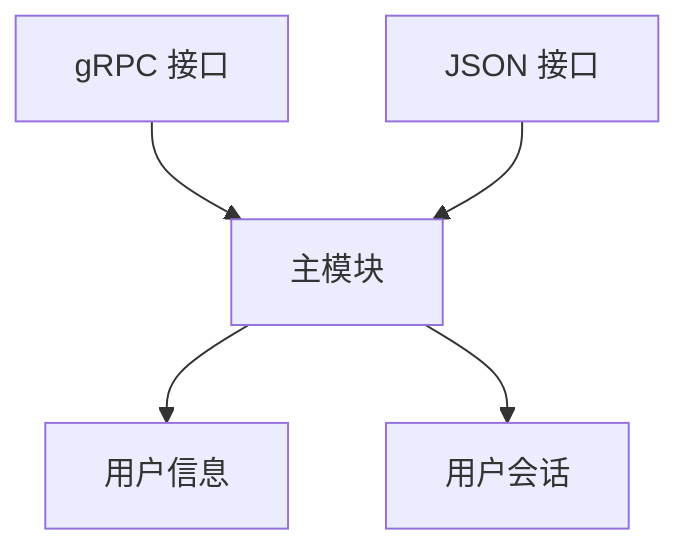

## app_prod_im

### 功能梳理
#### 功能列表
##### 1. 总体功能
   用户使用客户端向联系人收发聊天消息

##### 2. 客户端
   * 注册
   * 登录
   * 管理联系人
   * 向联系人发消息
   * 拉取聊天消息

##### 3. 服务端
   * 用户注册
   * 用户登录
   * 用户联系人管理
   * 客户端拉取聊天消息

#### 功能流程
##### 1. 注册
   客户端发起注册->服务端同意注册->服务端建立用户信息->成功
##### 2. 登录
   客户端用户登录->服务端检查用户ID和密码->服务端建立用户会话->客户端建立登录会话->成功
##### 3. 联系人管理
   * 获取联系人列表  
     客户端请求联系人列表->服务端返回联系人列表
   * 添加联系人  
     客户端请求添加联系人->服务端为用户添加联系人->成功->客户端本地添加联系人
   * 移除联系人  
     客户端请求移除联系人->服务端为用户移除联系人->成功->客户端本地移除联系人
##### 4. 发消息
   * 客户端向指定联系人发送消息->消息发往服务端->服务端保存聊天消息
   * 客户端拉取聊天消息->服务端返回聊天消息

### 模块
#### 模块划分
##### 1. 客户端
   * 主模块
   * 登录会话
   * 交互界面
   * 服务端网络 API

##### 2. 服务端
   * 主模块
   * 用户信息（包含聊天消息）
   * 用户会话
   * 网络 API 模块

#### 模块接口
##### 1. 客户端接口
   交互界面接口：
   * 注册
   * 登录
   * 获取联系人列表
   * 添加联系人
   * 移除联系人
   * 向联系人发送消息

##### 2. 服务端接口
   对客户端的接口：
   * 注册
   * 登录
   * 获取联系人列表
   * 添加联系人
   * 移除联系人
   * 客户端发送消息
   * 客户端拉取消息

   命令行接口：
   * 启动

##### 3. 客户端内部模块接口
* 主模块
  * 注册
  * 登录
  * 获取联系人列表
  * 添加联系人
  * 移除联系人
  * 向联系人发送消息
  * 运行
* 登录会话  
  * 开启会话  
  * 关闭会话  
  * 获取IO连接
* 交互界面  
  * 注册
  * 登录
  * 获取联系人列表
  * 添加联系人
  * 移除联系人
  * 向联系人发送消息
* 服务端网络 API
  * 注册
  * 登录
  * 获取联系人列表
  * 添加联系人
  * 移除联系人
  * 客户端发送消息
  * 客户端拉取消息

##### 4. 服务端内部模块接口
* 主模块
  * 注册
  * 登录
  * 获取联系人列表
  * 添加联系人
  * 移除联系人
  * 客户端发送消息
  * 客户端拉取消息
  * 运行
* 用户信息  
  * 添加用户  
  * 移除用户  
  * 添加用户联系人  
  * 移除用户联系人  
  * 获取用户联系人列表
  * 添加聊天消息
  * 拉取聊天消息
* 用户会话  
  * 添加用户会话  
  * 移除用户会话  
  * 查找用户会话
* 网络 API 模块
  * 注册
  * 登录
  * 获取联系人列表
  * 添加联系人
  * 移除联系人
  * 客户端发送消息
  * 客户端拉取消息

#### 模块间关系
##### 1. 模块关系图
* 服务端子模块


##### 2. 功能运行时序图

### 数据结构
#### 1. 主要数据结构
* ID  
  由6到28个字符组成。合法的字符包括英文字母、阿拉伯数字、短横线和下划线。英文字母不区分大小写。

* 联系人

|字段           |描述          |类型      |
|----           |----        |----      |
| contact_id    |联系人ID     |字符串     |
| contact_name  |联系人名字    |字符串    |

* 聊天消息

|字段           |描述          |类型      |
|----           |----         |----      |
| sender_id     |发送者ID    |字符串 |
| receiver_id   |接收者ID    |字符串 |
| io_port     |IO接口     |IO接口 |

### 协议与编程语言
#### 1. 客户端与服务端之间的通信协议
grpc、jsonrpc
#### 2. 客户端编程语言
C++
#### 3. 服务端编程语言
C++
   
### 接口定义
#### 1. 客户端接口
交互接口：
* 启动
```shell
./<program> c <user id>
``` 
在交互式 REPL 中：  
* 注册
```shell
reg <user passwd>
```
* 登录
```shell
login <user passwd>
```
* 获取联系人列表
```shell
cont_list
```
* 添加联系人
```shell
cont_add <contact id> <contact name>
```
* 移除联系人
```shell
cont_del <contact id>
```
* 向联系人发送消息
```shell
msg <contact id> <message>
```

#### 2. 服务端接口
对客户端的 grpc 接口：
* 注册  
接口名称：register  
参数：  

|字段         |描述     |类型      |
|----       |----     |----      |
| user_id   |用户 ID    |字符串 |
| user_pass  |用户密码  |字符串 |

返回值：  

|字段      |描述     |类型      |
|----     |----      |----    |
| result  |结果      |int      |

* 登录  
接口名称：login  
参数：  
  
|字段         |描述     |类型      |
|----       |----     |----      |
| user_id   |用户 ID    |字符串 |
| user_pass  |用户密码  |字符串 |
  
返回值：  

|字段      |描述     |类型      |
|----     |----      |----    |
| result  |结果      |int      |

* 获取联系人列表  
接口名称：get_contact_list  
参数：无
 
返回值：

|字段           |描述         |类型     |
|---            |---        |---    |
|result         |结果       |int   |
|contact_list   |联系人列表   |联系人数组   |

联系人：

|字段           |描述       |类型     |
|---            |---           |---    |
|contact_id    |联系人 ID      |字符串   |
|contact_name   |联系人备注   |字符串   |

* 添加联系人  
接口名称：add_contact  
参数：  
  
|字段         |描述     |类型      |
|----       |----     |----      |
|contact_id   |联系人ID    |字符串 |
|contact_name  |联系人备注  |字符串 |
  
返回值：  

|字段      |描述     |类型      |
|----     |----      |----    |
|result   |结果      |int      |

* 移除联系人  
接口名称：del_contact  
参数：

|字段         |描述     |类型      |
|----       |----     |----      |
|contact_id   |联系人ID    |字符串 |

返回值：  

|字段      |描述     |类型      |
|----     |----      |----    |
|result  |结果      |int      |

* 客户端发送消息  
接口名称：client_send_chat_msg  
参数：  

|字段             |描述          |类型      |
|----           |----           |----      |
| receiver_id   |接收者 ID     |字符串 |
| chat_msg      |聊天消息内容    |字符串 |

* 客户端拉取消息  
接口名称：client_get_chat_msg  
参数：  

|字段             |描述          |类型      |
|----           |----           |----      |
| user_id       |用户 ID         |字符串 |

返回值：  

|字段      |描述       |类型      |
|----     |----       |----    |
| result  |结果        |int      |
| chat_msg  |聊天消息    |聊天消息数组 |

命令行接口：
* 启动
```shell
./<program>
```

#### 3. 客户端内部模块接口
* 主模块
  * 注册
    register，参数：用户ID 字符串，用户密码 字符串；返回值：结果 int
  * 登录
    login，参数：用户ID 字符串，用户密码 字符串；返回值：结果 int
  * 获取联系人列表
    get_contact_list，参数：无；返回值：联系人数组
  * 添加联系人
    add_contact，参数：联系人ID 字符串，联系人名字 字符串；返回值：结果 int
  * 移除联系人
    del_contact，参数：联系人ID 字符串
  * 向联系人发送消息
    send_msg_to_contact，参数：联系人ID 字符串，聊天消息内容 字符串；返回值：结果 int
  * 运行
    run
* 登录会话  
  * 开启会话  
    login_session_open，参数：IO连接 socket；返回值：结果 int  
  * 关闭会话  
    login_session_close  
  * 获取IO接口  
    login_session_get_io_port，参数：无；返回值：IO连接 socket
* 交互界面
  * 注册
  * 登录
  * 获取联系人列表
  * 添加联系人
  * 移除联系人
  * 向联系人发送消息
* 服务端网络 API
  * 注册
  * 登录
  * 获取联系人列表
  * 添加联系人
  * 移除联系人
  * 客户端发送消息
  * 客户端拉取消息

#### 4. 服务端内部模块接口
* 主模块
  * 注册
    register，参数：用户ID 字符串，用户密码 字符串；返回值：结果 int
  * 登录
    login，参数：用户ID 字符串，用户密码 字符串；返回值：结果 int
  * 获取联系人列表
    get_contact_list，参数：用户ID 字符串；返回值：联系人数组
  * 添加联系人
    add_contact，参数：用户ID 字符串，联系人ID 字符串，联系人名字 字符串；返回值：结果 int
  * 移除联系人
    del_contact，参数：用户ID 字符串，联系人ID 字符串；返回值：
  * 客户端发送消息
    client_send_chat_msg，参数：发送者ID 字符串，接收者ID 字符串，聊天消息内容 字符串；返回值：结果 int
  * 客户端拉取消息
    client_get_chat_msg，参数：用户ID 字符串；返回值：结果 int；聊天消息 聊天消息数组
  * 运行
    run
* 用户信息  
  * 添加用户  
    user_add，参数：用户ID 字符串，用户密码 字符串；返回值：结果 int
  * 移除用户  
    user_del，参数：用户ID 字符串
  * 添加用户联系人  
    user_contact_add，参数：用户ID 字符串，联系人ID 字符串，联系人备注 字符串；返回值：结果 int
  * 移除用户联系人  
    user_contact_del，参数：用户ID 字符串，联系人ID 字符串
  * 获取用户联系人列表  
    user_contact_get_list，参数：用户ID 字符串；返回值：联系人列表 联系人ID+联系人备注
  * 添加聊天消息
  * 拉取聊天消息
* 用户会话  
  * 添加用户会话  
    user_session_add，参数：用户ID 字符串，用户会话；返回值：结果 int
  * 移除用户会话  
    user_session_del，参数：用户ID 字符串
  * 查找用户会话  
    user_session_find，参数：用户ID 字符串；返回值：用户会话
* 网络 API 模块
  * 注册
  * 登录
  * 获取联系人列表
  * 添加联系人
  * 移除联系人
  * 客户端发送消息
  * 客户端拉取消息

### 工作量列表
#### 1. 客户端 grpc 接口
#### 2. 客户端内部模块
#### 3. 客户端内部模块整合
#### 4. 服务端 grpc 接口
#### 5. 服务端内部模块
#### 6. 服务端内部模块整合
